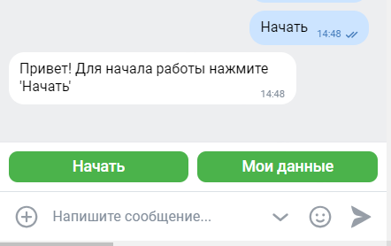
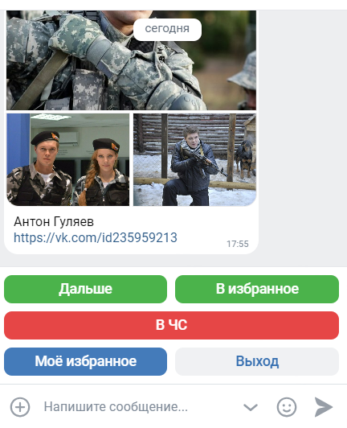
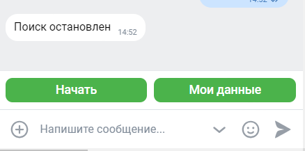
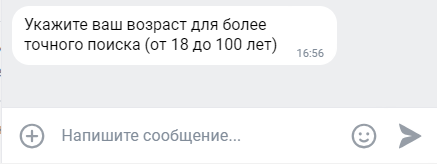
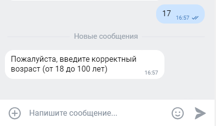
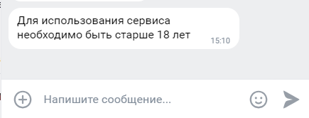
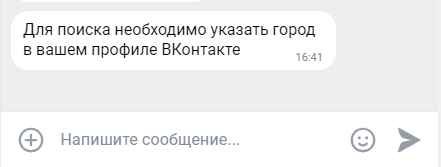
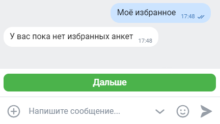
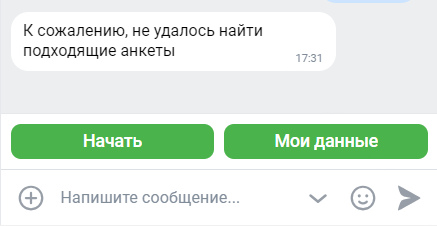

# Документация по использованию программы.

Бот, используя информацию (возраст, пол, город) о пользователе,
с которым общается, осуществляет поиск других пользователей  для знакомств Вконтакте.

Для запуска бота можно написать в сообщении "Начать" или любое другое слово.

Назначение кнопок:

- "Мои данные" - просмотр id пользователя, который общается с ботом;

- "Начать" - для начала поиска.

При успешном поиске  бот выведет в чат информацию о людях:
- три популярные фотографии (популярность определяется по количеству лайков);
- имя и фамилия;
- ссылка на профиль.

Назначение кнопок:

- "Дальше" — переход к следующему человеку;
- "В избранное" — сохранение человека в "Моё избарнное";
- "В ЧС" — добавление человека в чёрный список;
- "Моё избранное" — отображение избранных пользователей;
- "Выход" - выход из поиска:

 

### Возможные предупреждения

- Если в профиле пользователя, взаимодействующего с ботом, не указан возраст

  

- Если пользователь указал некорректный возраст

  

- Если возраст пользователя, который общается с ботом, меньше 18 лет

  

- Если в профиле пользователя, взаимодействующего с ботом, не указан город

  

- Если у пользователя нет данных в “Моё избранное”

  

- Если не удалось найти подходящие анкеты
  
  
